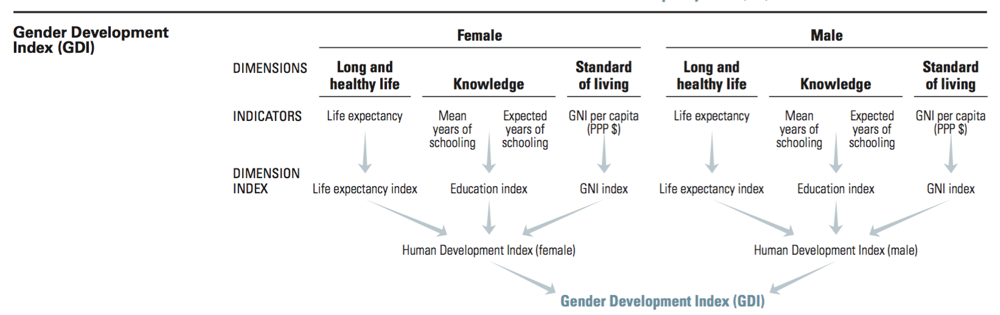

# UNDP AFHDR 2015 Projects, Jacob Romer

## Project 1: [The Story Behind the Data](story)

### Research Question

What story does the AFHDR data tell when condensed into a one-sentence biography of an average female citizen?

### Description

- The page displays a single, run-on sentence describing the life of an average female citizen of a given African country through the lens of the data provided.
- The user can cycle through countries by selecting them from a drop-down menu or pressing `n` and `p`.

### Methodology

- A condensed dataset of the relevant indicators was compiled by hand. It's imported as a `.tsv` file.
- [React](https://facebook.github.io/react/) handles data processing and display. 

## Project 2: [Exploring the GDI](gdi-calc)

### Research Question

- Can an interactive display make the GDI more understandable? Can it empower users to understand, manipulate and critique the makeup of the GDI in a playful manner?

### Description

- The project is in essence an interactive version of the GDI calculation flowchart (See p. 1 of the [2014 HDR Technical Notes](http://hdr.undp.org/sites/default/files/hdr14_technical_notes.pdf))

- Users can select which country to examine and see the values update accordingly.
- Each of the indicators can be manipulated by clicking and dragging, with the variables depending on it updating in real time.

### Methodology

- A condensed dataset of the relevant indicators was compiled by hand. It's imported as a `.tsv` file.
- [React](https://facebook.github.io/react/) handles data processing and display.
- The Dimension Indices, gender-disaggregated HDI values and GDI are calculated live at runtime, with the respective formulae set up in accordance with [2014 HDR Technical Notes reference specification](http://hdr.undp.org/sites/default/files/hdr14_technical_notes.pdf)  
